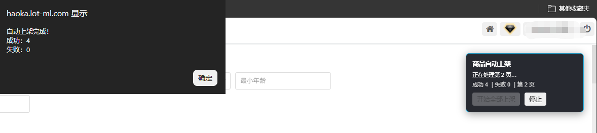
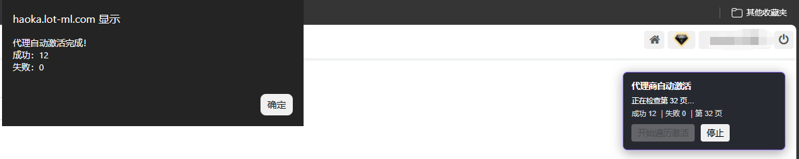

# 172haoka-auto

适用于 172 号卡订单管理系统的 Tampermonkey（油猴）或 violentmonkey（暴力猴）自动化助手。

## 功能

### 宽带商品自动上架

在“商品管理 → 宽带选品广场”中：

- 自动切换为每页 90 条并返回第 1 页
- 逐个点击“上架”并确认
- 当前页每个待上架商品只执行一次“上架 → 确认”
- 每次点击确认后等待 1 秒再处理下一个商品
- 当前页操作完毕后直接进入下一页，不等待或核验后台上架状态
- 自动遍历到最后一页
- 支持随时安全停止

### 代理商自动激活

在“代理商管理 → 代理商列表”中：

- 自动切换为每页 20 条并返回第 1 页
- 自动查找“激活”按钮并确认
- 自动遍历到最后一页
- 失败操作最多重试 3 次
- 支持随时安全停止

## 安装

1. 浏览器安装 [Tampermonkey](https://www.tampermonkey.net/) 或 [violentmonkey](https://violentmonkey.github.io/)。
2. 打开 [greasyfork](https://greasyfork.org/zh-CN/scripts/592000-172%E5%8F%B7%E5%8D%A1-%E5%95%86%E5%93%81%E4%B8%8A%E6%9E%B6%E4%B8%8E%E4%BB%A3%E7%90%86%E6%BF%80%E6%B4%BB%E5%8A%A9%E6%89%8B)。
3. 点击 安装，然后由 Tampermonkey 或 violentmonkey 确认安装。
4. 登录目标系统并进入对应列表页面。
5. 使用页面右上角的控制面板手动启动任务。

## 使用提醒

- 脚本不会在页面打开后自动执行，必须手动点击开始并再次确认。
- 执行期间请保持目标页面开启，不要手动切换分页。
- 已上架商品和无需激活的代理会被自动跳过。
- 网站结构发生变化后，脚本选择器可能需要同步更新。
